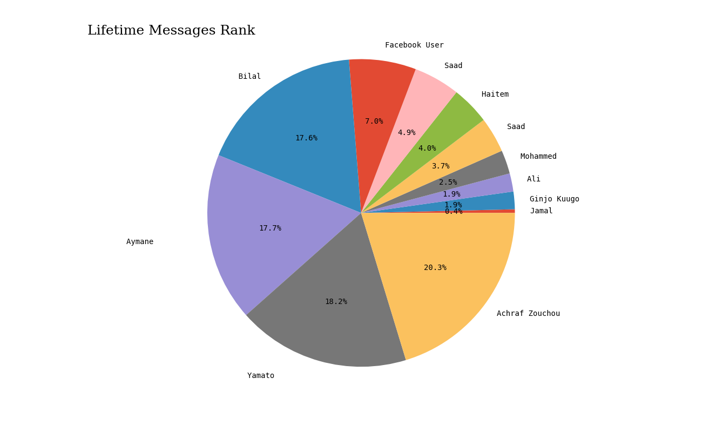
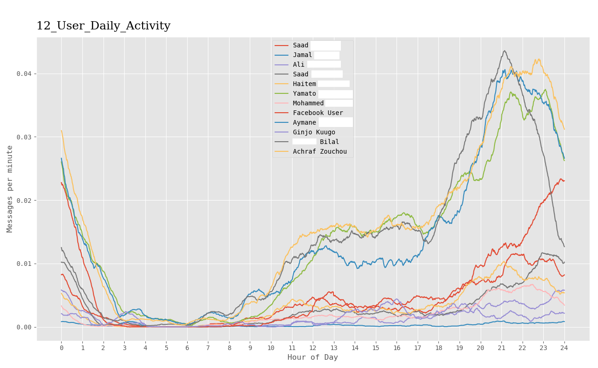
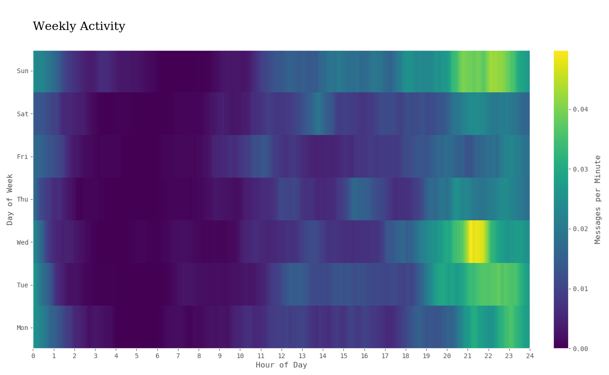
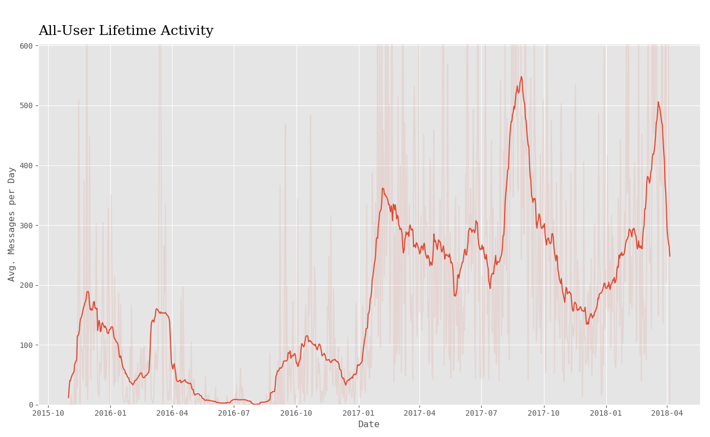
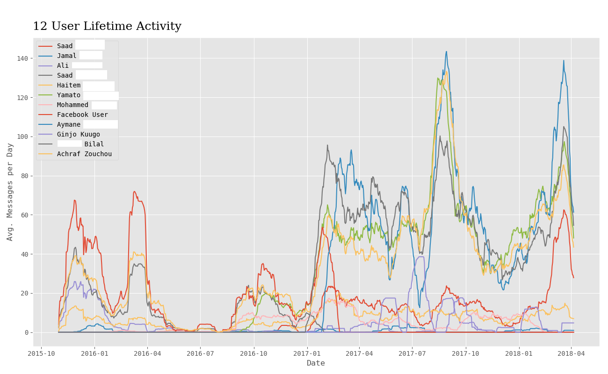

# facebook_analyse
Script that parse and analyse data from a facebook html chat.

#  Results example:

How to use:

download the zip file from facebook containing all your data.

put the 'name_of_the_conversation'.html file in the chat folder.

and in the terminal use:

  python main.py name_of_the_conversation -all
  
and the result will be created on a folder named result
